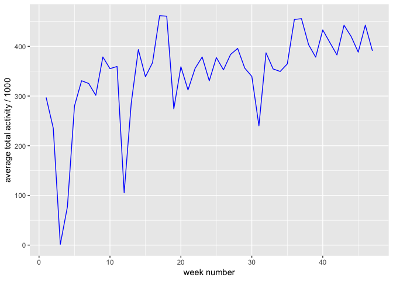
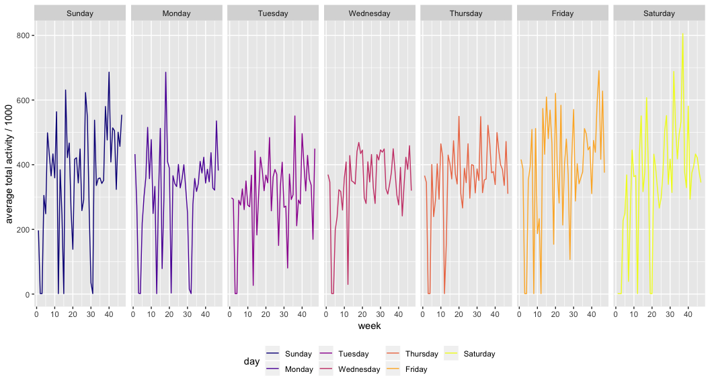
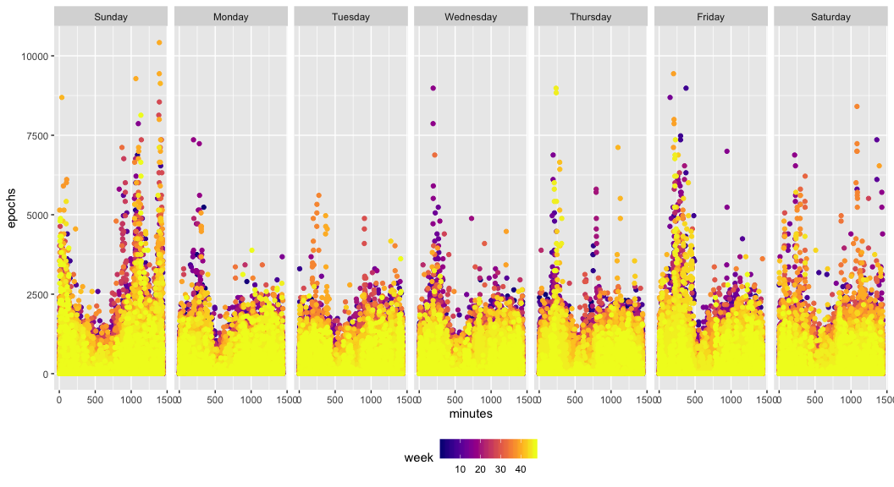
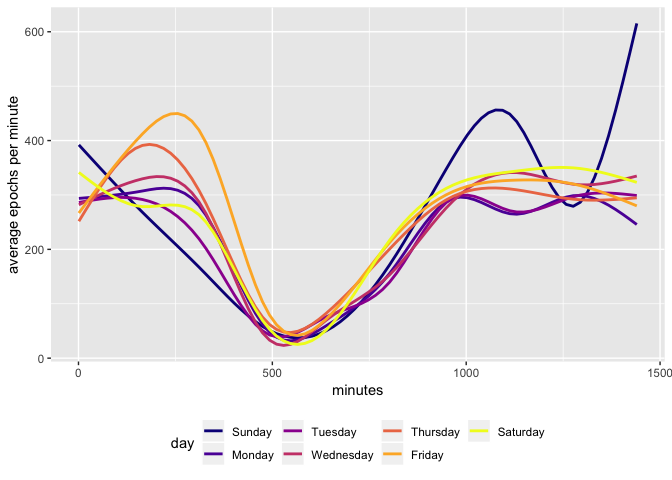

Midterm project
================
Nathalie Fadel
10/16/2018

Import and clean dataset
------------------------

``` r
exercise_data = read_csv(file = "./data/p8105_mtp_data.csv")
```

    ## Parsed with column specification:
    ## cols(
    ##   .default = col_double(),
    ##   week = col_integer(),
    ##   day = col_character()
    ## )

    ## See spec(...) for full column specifications.

``` r
exercise_data = 
  exercise_data %>%
  gather(key = minutes, value = activity, activity.1:activity.1440) %>%
  mutate(minutes = str_replace(minutes, "activity.", ""),
         minutes = fct_relevel(minutes, str_c("", c("1-1440")))) %>%
  mutate(minutes = as.numeric(minutes)) %>%
  rename(epochs = activity) %>%
  mutate(day = factor(day, levels = c("Sunday", "Monday", "Tuesday", "Wednesday", "Thursday", "Friday", "Saturday"))) %>%
  arrange(week, day, minutes)
```

    ## Warning: Unknown levels in `f`: 1-1440

``` r
exercise_data = exercise_data %>%
  group_by(week, day) %>%
  mutate(total_exercise = sum(epochs))
```

Descriptive statistics
----------------------

``` r
exercise_data %>% arrange(desc(total_exercise)) %>% head(1)
```

    ## # A tibble: 1 x 5
    ## # Groups:   week, day [1]
    ##    week day      minutes epochs total_exercise
    ##   <int> <fct>      <dbl>  <dbl>          <dbl>
    ## 1    37 Saturday       1    74.        805355.

``` r
exercise_data %>% filter(total_exercise == 1440) %>% count()
```

    ## # A tibble: 18 x 3
    ## # Groups:   week, day [18]
    ##     week day           n
    ##    <int> <fct>     <int>
    ##  1     1 Saturday   1440
    ##  2     2 Sunday     1440
    ##  3     3 Sunday     1440
    ##  4     3 Wednesday  1440
    ##  5     3 Thursday   1440
    ##  6     3 Friday     1440
    ##  7     4 Monday     1440
    ##  8     4 Wednesday  1440
    ##  9     4 Thursday   1440
    ## 10     4 Friday     1440
    ## 11     8 Friday     1440
    ## 12    12 Sunday     1440
    ## 13    12 Friday     1440
    ## 14    12 Saturday   1440
    ## 15    13 Monday     1440
    ## 16    19 Saturday   1440
    ## 17    20 Saturday   1440
    ## 18    32 Monday     1440

This dataset has 473760 observations and 5 variables. The "epochs" variable is the numer of electric signals recorded per minute of the day, and the "minutes" variable is the minute of the day that the epochs were recorded. The "week" variable is the week number (1-47) that the subject wore the device. The "total exercise" variable is the total amount of signals recorded per day. The maximum total activity is 805355, which occurred on the Saturday of week 37. The minimum total activity is 1440, which occurrs on 18 different days over the course of the 47 week period. The mean total activity recorded in week 1 and week 47 is 1, 2.971907110^{5} and 47, 3.909375710^{5}, respectively.

Exploratory analysis
--------------------

``` r
exercise_data %>% 
  group_by(week) %>% 
  summarize(avg_total_exercise = mean(total_exercise) / 1000) %>%
  ggplot(aes(x = week, y = avg_total_exercise)) +
  geom_line(color = "blue") +
  labs(y = "average total activity / 1000", x = "week number")
```



From the mean comparison, we saw that the average total activity between week 1 and week 47 is more similar than one would expect. However, we see from this line graph that the variability in total activity decreases over time, meaning that on average, he becomes more consistent with his activity level. Also, week 3 is an outlier, as it is substantially lower than the average total from any of the other weeks.

``` r
exercise_data %>%
  group_by(week, day) %>%
  summarize(mean_total_exercise = mean(total_exercise) / 1000) %>%
  ggplot(aes(x = week, y = mean_total_exercise)) +
  geom_line(aes(color = day)) +
  viridis::scale_color_viridis(name = "day", discrete = TRUE, option = "plasma") +
  theme(legend.position = "bottom") +
  labs(y = "average total activity / 1000") +
  facet_grid(~day)
```



Per the line graphs above, weekends have more variability than weekdays, with Saturday experiencing the highest variability and Wednesday and Thursday having the lowest. At early observations, variability for all days is high, but weekend days still experience the highest variability out of the week, even towards the end of the study period.

``` r
exercise_data %>%
  group_by(day, week) %>%
  ggplot(aes(x = minutes, y = epochs)) +
  geom_point(aes(color = week)) +
  viridis::scale_color_viridis(name = "week", option = "plasma") +
  theme(legend.position = "bottom") +
  facet_grid(~day)
```

 This scatter plot shows the daily trends, minute by minute, from weeks 1-47, grouped by day of the week. Sundays reflect higher activity towards the afternoon, Fridays have high activity in the morning, and Saturdays have both. Monday and Tuesday are generally less active overall. Wednesdays trend towards morning activity, and Thursdays vary from week to week.

``` r
exercise_data = exercise_data %>%
  group_by(day, minutes) %>%
  mutate(avg_epochs = mean(epochs))

exercise_data %>%
  group_by(day, week) %>%
  ggplot(aes(x = minutes, y = avg_epochs, color = day)) +
  geom_smooth(se = FALSE) +
  viridis::scale_color_viridis(name = "day", discrete = TRUE, option = "plasma") +
  theme(legend.position = "bottom") +
  labs(y = "average epochs per minute")
```

    ## `geom_smooth()` using method = 'gam' and formula 'y ~ s(x, bs = "cs")'

 This plot displays the average epochs per minute aggregated across the study period, grouped by day of the week. It shows similar trends as the scatter plot, but here we can clearly see that on Sundays, activity is highest in the afternoon and evening, and activity is highest in the morning on Fridays.

| Method          | koRpus      | stringi       |
|:----------------|:------------|:--------------|
| Word count      | 355         | 343           |
| Character count | 2140        | 2139          |
| Sentence count  | 18          | Not available |
| Reading time    | 1.8 minutes | 1.7 minutes   |
